# NovaCall 📞

A 1-to-1 calling application built with Flutter that allows users to make audio and video calls in real-time.


---

## 📱 About The App

**NovaCall** is a Flutter-based mobile application that enables users to:

- Create an account and sign in securely
- View and search through contacts
- Make 1-to-1 audio and video calls
- Receive incoming calls with accept/reject options
- Control calls (mute, camera on/off, switch camera, end call)
- View call history with details (type, duration, status)
- Block unwanted users
- Toggle between light and dark themes

The app is built as part of a Flutter Development Internship Assignment.

---

## ✨ Features

### Core Features
- ✅ **Authentication** — Login, Register, Logout (Firebase Auth with email verification)
- ✅ **Contacts List** — View all users with online/offline status
- ✅ **Search** — Real-time search through contacts
- ✅ **Audio Calls** — 1-to-1 voice calls with full controls
- ✅ **Video Calls** — 1-to-1 video calls with camera controls
- ✅ **Incoming Calls** — Accept/Reject incoming calls
- ✅ **Call Controls** — Mute, Camera on/off, Switch camera, End call
- ✅ **Call History** — View past calls with type, duration, and status
- ✅ **User Profile** — View and edit profile, logout
- ✅ **Permissions Handling** — Microphone and camera permissions

### Bonus Features
- ✅ **Dark Mode** — Full light/dark theme support
- ✅ **Push Notifications** — Incoming call notifications
- ✅ **Background Calls** — Receive calls even when app is in background
- ✅ **Recent Contacts** — Frequently called users shown at top of Home
- ✅ **Block User** — Block/unblock users from contacts

---

## 🛠️ Tech Stack

### Frontend
- **Flutter** 3.32.7 (stable)
- **Dart** 3.12.2

### State Management
- **BLoC / Cubit** (flutter_bloc ^8.1.6)

### Backend
- **Firebase Authentication** (email/password)
- **Cloud Firestore** (user data, call history, blocking)

### Calling SDK
- **ZEGOCLOUD** (`zego_uikit_prebuilt_call` ^4.24.4 + `zego_uikit_signaling_plugin` ^2.8.21)
- **Why ZEGOCLOUD?** Pre-built UI components, reliable signaling, easy integration with Flutter, and built-in support for 1-to-1 calls, incoming call invitations, and call controls.

### Other Packages
- `permission_handler` ^12.0.3 — Runtime permissions
- `awesome_dialog` ^3.3.0 — Beautiful dialogs
- `intl` ^0.19.0 — Date/time formatting
- `dio` ^5.11.1 — HTTP client
- `async` ^2.11.0 — Stream utilities

---

## 🏗️ Architecture

The project follows a **Clean Architecture** approach with clear separation of concerns:
lib/
├── business_logic/ # State management (Cubits)
│ ├── cubit/ # AuthCubit
│ ├── contactCubit/ # ContactCubit
│ ├── callHistoryCubit/ # CallHistoryCubit
│ └── ThemeCubit.dart # Theme management
│
├── constants/ # App constants
│ ├── icon/ # Icons & GIFs
│ └── strings/ # String constants & routes
│
├── data/ # Data layer
│ ├── model/ # Data models (User, CallModel)
│ ├── repository/ # Repositories
│ └── services/ # Firebase services
│
└── presentation/ # UI layer
├── screens/
│ ├── SplashScreen.dart
│ ├── auth/ # Login, Register
│ └── main/ # Home, Contacts, Profile, CallHistory
└── widgets/ # Reusable widgets (UserTile)


### Data Flow

UI (Widgets) → Cubit (State) → Repository → Service (Firebase/Zego)

---

## 🚀 Setup Instructions

### Prerequisites
- Flutter SDK 3.32.7 or higher
- Android Studio / VS Code
- Firebase account
- ZEGOCLOUD account

### 1. Clone the Repository
bash
git clone https://github.com/TahaKospar/novacall.git
cd novacall

2. Install Dependencies
```flutter pub get```

3.  Firebase Setup
1.Create a Firebase project at console.firebase.google.com

2.Enable Authentication (Email/Password)

3.Enable Cloud Firestore

4.Download google-services.json and place it in android/app/

5.Update FirebaseOptions if needed

4. ZEGOCLOUD Setup
1.Create a project at console.zegocloud.com

2.Get your AppID and AppSign

3.Update them in lib/main.dart:
const int zegoAppID = YOUR_APP_ID;
const String zegoAppSign = "YOUR_APP_SIGN";

4.Register a Resource ID named zegouikit_call in the ZEGOCLOUD Console

5. Run the App
flutter run

6. Build APK
flutter build apk --release
Output: build/app/outputs/flutter-apk/app-release.apk

## 📸 Screenshots

| Login | Register | Edit Profile |
|-------|----------|--------------|
| 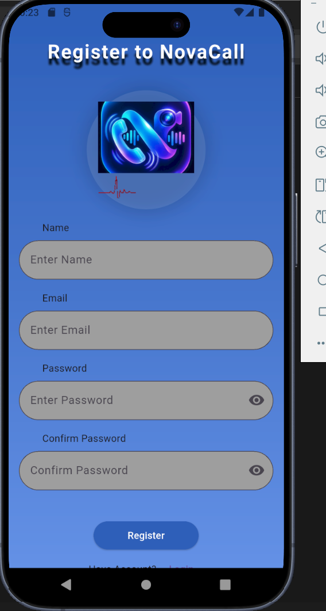 | 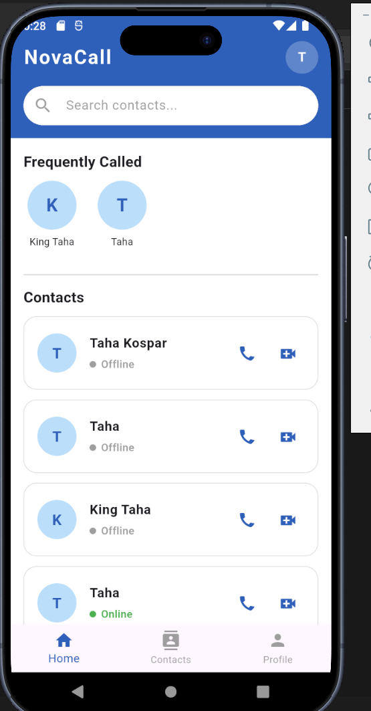 | 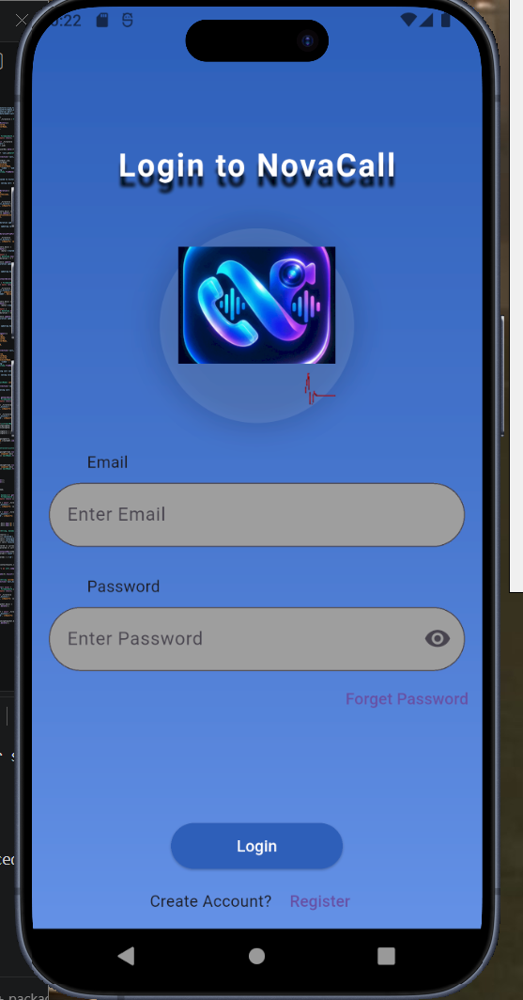 |

| Home | Contacts | Search |
|------|----------|--------|
| 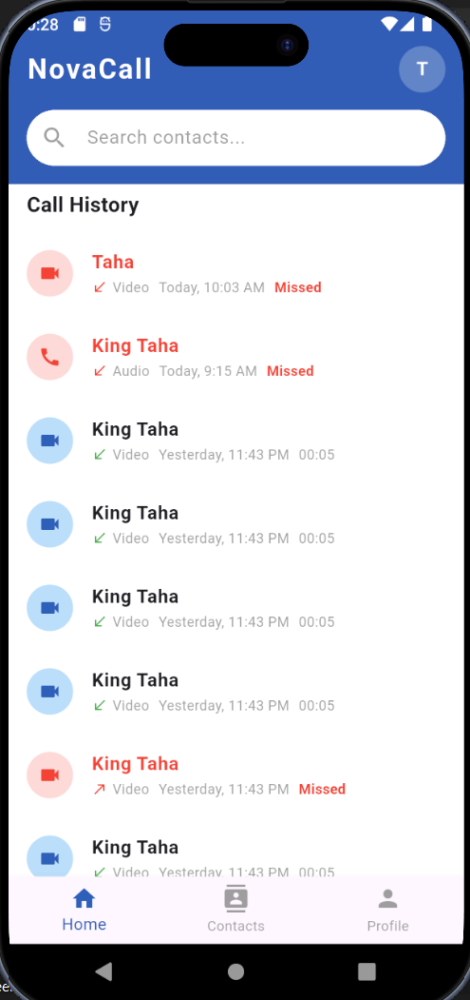 | 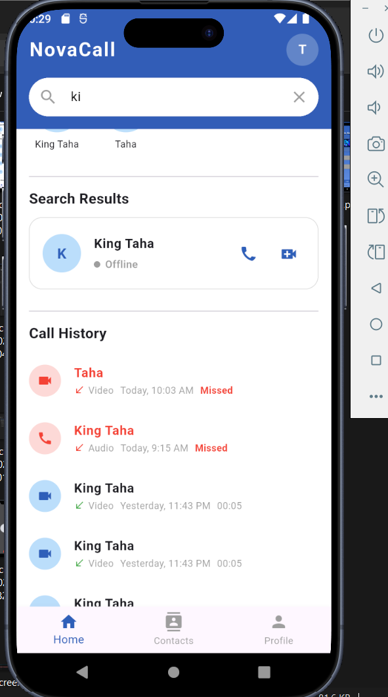 | 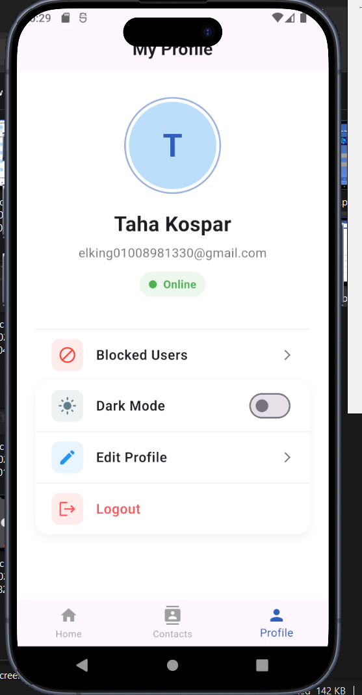 |

| Call History | Profile (Light) | Profile (Dark) |
|--------------|-----------------|----------------|
| 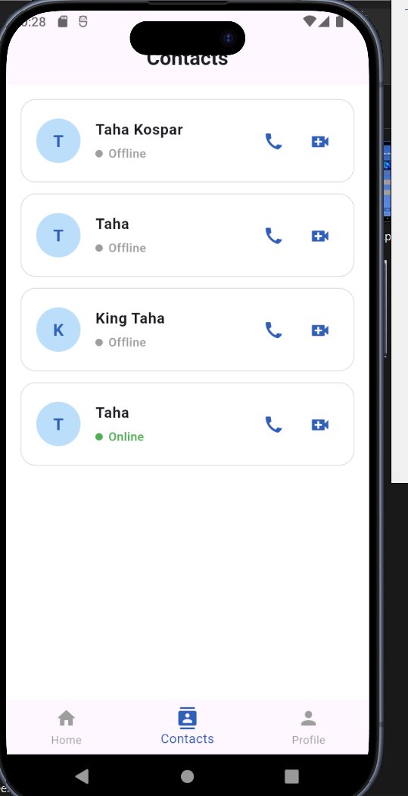 | 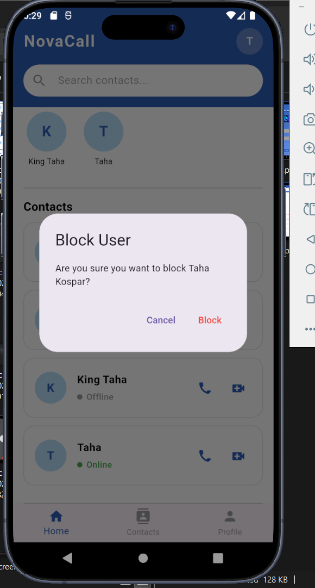 | 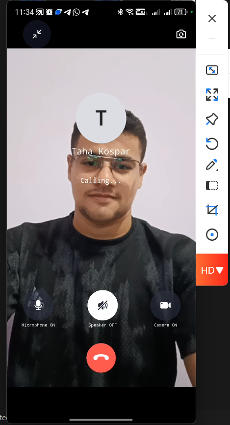 |

| Block User | Blocked Users | Video Call |
|------------|---------------|------------|
| 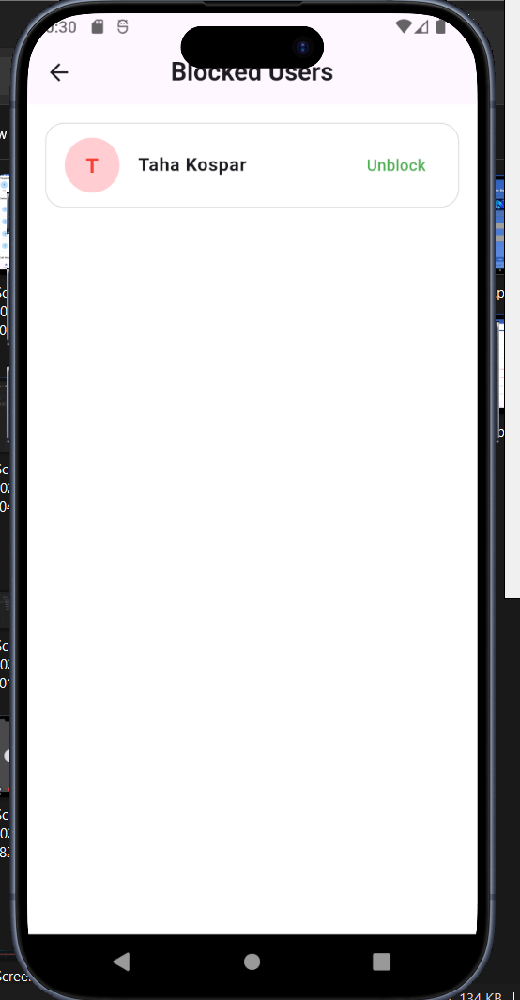 | 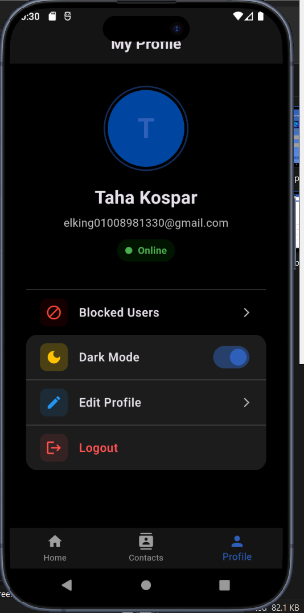 | 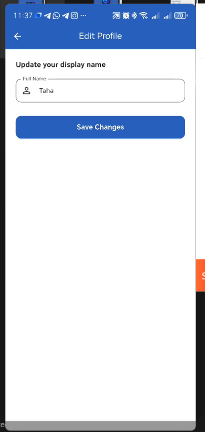 |

📖 How It Works
Authentication Flow
User registers with email/password

Email verification is sent

User verifies email and logs in

ZegoUIKitPrebuiltCallInvitationService is initialized with the user's ID

Calling Flow
User taps call button on a contact

ZEGOCLOUD sends an invitation to the receiver

Receiver sees incoming call notification

Receiver accepts → both users join the call room

Call happens via ZEGOCLOUD's real-time communication

When call ends, duration is calculated and saved to Firestore

Call History
Every call is saved in Firestore with: caller, receiver, type, duration, status

History is fetched in real-time using Firestore streams

Duration is calculated based on createdAt timestamp

Block User
User can long-press on any contact to block them

Blocked users are stored in blockedUsers array in the user document

Blocked users are filtered out from the contacts list

Users can view and unblock from Profile → Blocked Users

⚠️ Known Limitations
Group calls — Not implemented (only 1-to-1)

Screen sharing — Not implemented

Call recording — Not implemented

Network quality indicator — Not displayed (ZEGOCLOUD doesn't expose it as a pre-built button)

Call History duration — Approximated based on timestamps (may not be 100% accurate if app is killed)

iOS build — Only Android APK provided

🤖 AI Tools Used
The following AI tools were used during development:

ChatGPT (OpenAI) — Used for debugging Gradle build issues, Firebase setup, and code review

Claude (Anthropic) — Used for architecture design and code explanations

DeepSeek — Used for troubleshooting ZEGOCLOUD integration

GitHub Copilot — Used for autocomplete and boilerplate code

Note: All code was reviewed, understood, and tested by the developer. The AI tools were used as assistants, not as replacements.

📄 License
This project is created for educational and internship evaluation purposes.

👤 Author
Taha Kospar

GitHub: @TahaKospar

🙏 Acknowledgments
Flutter

Firebase

ZEGOCLOUD

BLoC Library
